# VersaNode OS Build Process (pi-gen Workflow)

This document explains how the **VersaNode OS** image is built using the Raspberry Pi **pi-gen** build system,
extended with two custom injected stages: **versanode-os-kmods** and **versanode-os-usermods**.

---

## 🧩 Build Flow Overview

```mermaid
flowchart TD
    A["pi-gen Generator"] --> B["Official pi-gen Stages (stage0 → stage2)"]
    B --> C["Injected Stage: versanode-os-kmods (stage2-kmods)"]
    C --> D["Continue pi-gen Stages (stage3 → stage5)"]
    D --> E["Injected Final Stage: versanode-os-usermods (stage9-usermods)"]
    E --> F["Output: VersaNode OS Image (.img)"]
```



---

## 🧱 Stage Descriptions

| Stage | Description |
|--------|--------------|
| **stage0–2** | Core Raspberry Pi OS base, firmware, and kernel setup. |
| **stage2-kmods** | Injected stage that builds and installs VersaNode-specific kernel modules. |
| **stage3–5** | Optional official stages that add additional system features, desktop packages, and extras. |
| **stage9-usermods** | Injected final stage that installs Cockpit, removes unused packages, and adds VersaNode VNC Manager. |
| **export-image** | Produces the final compressed VersaNode OS `.img` file ready for flashing. |

---

## ⚙️ Automation Overview

The **GitHub Actions workflow** (`.github/workflows/build.yml`) does the following:

1. Checks out this repository and its submodules (`pi-gen`, `versanode-os-kmods`, `versanode-os-usermods`).
2. Copies the custom stages into `pi-gen/` as `stage2-kmods` and `stage9-usermods`.
3. Generates a configuration file defining which stages to build.
4. Runs the pi-gen build process inside the runner.
5. Collects and uploads the generated `.img.xz` artifacts.
6. Optionally publishes a GitHub Release containing the built image.

---

## 📦 Output

The final result is a bootable **VersaNode OS image** containing:
- Custom kernel modules (from `versanode-os-kmods`)
- Cockpit-based management interface and tools (from `versanode-os-usermods`)
- Full Raspberry Pi OS core base (pi-gen official stages)

Resulting image filename pattern:
```
versanode-os-<release>-<arch>-<variant>.img.xz
```

---

© VersaNode Project — built with ❤️ on top of [pi-gen](https://github.com/RPi-Distro/pi-gen)
