# VersaNode OS

<p align="center">
  <!-- Workflows -->
  <a href="https://github.com/Versa-Node/versanode-os/actions/workflows/ci.yml">
    
  </a>
  <a href="https://github.com/Versa-Node/versanode-os/actions/workflows/build-release.yml">
    
  </a>
  <a href="https://github.com/Versa-Node/versanode-os/actions/workflows/pr-labeler.yml">
    
  </a>
  <a href="https://github.com/Versa-Node/versanode-os/actions/workflows/release-drafter.yml">
    
  </a>
</p>


---

## 🚀 Recommended Image

**VersaNode recommends the _Lite_ variant** for most users and devices.  
Lite gives you the smallest image and fastest boot while still including all VersaNode features added by the custom stages.

---

## 🧩 Build Flow (pi-gen)

VersaNode OS is built with [`Raspberry Pi’s pi-gen`](https://github.com/RPi-Distro/pi-gen),  
with VersaNode’s kernel- and user-level modifications injected as custom stages:



```mermaid
%%{init: {"theme": "default", "themeVariables": { "fontSize": "10px", "fontFamily": "Arial", "lineHeight": "1", "nodeSpacing": "10", "rankSpacing": "10"}}}%%
flowchart TD
    A["pi-gen Generator"] --> B["Official pi-gen Stages (stage0 → stage2)"]
    B --> C["Injected Stage: versanode-os-kmods (stage8)"]
    C --> D["Optional pi-gen Stages (stage3 → stage5)"]
    D --> E["Injected Final Stage: versanode-os-usermods (stage9)"]
    E --> F["Output: VersaNode OS Image (.img)"]
```

### Stages

| Stage | What it does |
|------:|--------------|
| **stage0–2** | Base Raspberry Pi OS, firmware, kernel, and core setup. |
| **~~stage3–5~~** | ~~=Stages for desktop and extra packages.~~ |
| **stage8** | **VersaNode OS Kmods submodule** — Kernel-level modifications. |
| **stage9** | **VersaNode OS Usermods submodule** — User-level services and provisioning. |

### Variants
- **Default:** `stage0 stage1 stage2 stage8 stage9`  
---

## 🔗 Submodules & Auto-Update

This repository uses two **Git submodules**:

- [`versanode-os-kmods`](https://github.com/Versa-Node/versanode-os-kmods) → injected as **`stage8`**
- [`versanode-os-usermods`](https://github.com/Versa-Node/versanode-os-usermods) → injected as **`stage9`**

Each submodule repository includes a **GitHub Action** that automatically updates this repo when changes occur,  
either by **pushing** directly or **opening a PR** (depending on access).

> 💡 Use a fine-grained PAT with `contents:write` on `Versa-Node/versanode-os` for secure submodule updates.

---

## ⚙️ Build via GitHub Actions

The **Build & Release** workflow can be triggered manually and performs:

1. Checkout of repo and all submodules (`pi-gen`, `versanode-os-kmods`, `versanode-os-usermods`)
2. Injection of submodules into `pi-gen/` as `stage8` and `stage9`
3. Dynamic config generation in CI (`pi-gen/config`)
4. pi-gen build execution
5. Upload of `.img.xz`, `.bmap`, `.sha256` artifacts
6. Optional GitHub Release publication

---

## ⚙️ Build Locally

You can build VersaNode OS locally without GitHub Actions — everything is automated through a single script.

### 🪄 One-command build

```bash
git clone --recursive https://github.com/Versa-Node/versanode-os.git
cd versanode-os
sudo bash scripts/build.sh
```

That’s it 🎉  
`scripts/build.sh` automatically:

- Installs all **pi-gen** dependencies  
- Syncs submodules  
- Injects custom stages (`versanode-os-kmods` → stage8, `versanode-os-usermods` → stage9)  
- Ensures only **stage9** exports the final image  
- Runs the **pi-gen** build process using your local `config` file  

### ⚙️ Optional custom configuration

Edit or create `config` at the repo root.

Example:
```bash
IMG_NAME=versanode-os
RELEASE=trixie
ARCH=arm64
ENABLE_SSH=1
FIRST_USER_NAME=versanode
FIRST_USER_PASS=versanode
USE_QEMU=1
STAGE_LIST="stage0 stage1 stage2 stage8 stage9"
```

### 📦 Build output

Images will appear under:
```
pi-gen/deploy/
```

Example:
```
versanode-os-2025-10-19.img.xz
```

---

## 📦 VersaNode OS Images & Flashing

Official images are published on [GitHub Releases](https://github.com/Versa-Node/versanode-os/releases).

Use **Raspberry Pi Imager** or flash manually after enabling USB boot mode.  
When flashing, hold the **VersaNode boot button** during power-on to expose eMMC as mass storage.

> More info: [Raspberry Pi USB Boot](https://github.com/raspberrypi/usbboot)

---

## 🔐 Default Credentials

| Setting | Default |
|----------|----------|
| **Hostname** | `versanode` |
| **Username** | `versanode` |
| **Password** | `versanode` |

Access the Cockpit dashboard via:  
👉 **https://versanode** → redirects to **https://versanode/cockpit/**

> 🛡️ TLS certificates are auto-generated on first boot by nginx-lite.  
> Hostname changes automatically trigger reissuance.

---

## 🧭 VersaNode Cockpit, VNCP Manager & Proxying

VersaNode OS includes:
- Lightweight **nginx-lite** reverse proxy  
- **VersaNode Cockpit** dashboard  
- **VNCP Manager** plugin for managing containerized applications  

### Highlights

- Visit `https://<hostname>` to access the dashboard  
- Automatic HTTPS termination using local CA  
- Dynamic nginx reconfiguration for VNCP containers  
- Seamless certificate reissuance  
- Provisioned during **stage9**

---

© VersaNode Project — built with ❤️ on top of [pi-gen](https://github.com/RPi-Distro/pi-gen)
