# VersaNode OS

<p align="center">
  <!-- Workflows -->
  <a href="https://github.com/Versa-Node/versanode-os/actions/workflows/ci.yml">
    
  </a>
  <a href="https://github.com/Versa-Node/versanode-os/actions/workflows/build-release.yml">
    
  </a>
  <a href="https://github.com/Versa-Node/versanode-os/actions/workflows/pr-labeler.yml">
    
  </a>
  <a href="https://github.com/Versa-Node/versanode-os/actions/workflows/release-drafter.yml">
    
  </a>
</p>


---

## 🚀 Recommended Image

**VersaNode recommends the _Lite_ variant** for most users and devices.  
Lite gives you the smallest image and fastest boot while still including all VersaNode features added by the custom stages.

---

## 🧩 Build Flow (pi-gen)

VersaNode OS is built with [`Raspberry Pi’s pi-gen `](https://github.com/RPi-Distro/pi-gen), with VersaNode' kernel- and user-level modifications injected as build stages:

```mermaid
%%{init: {"theme": "default", "themeVariables": { "fontSize": "10px", "fontFamily": "Arial", "lineHeight": "1", "nodeSpacing": "10", "rankSpacing": "10"}}}%%
flowchart TD
    A["pi-gen Generator"] --> B["Official pi-gen Stages (stage0 → stage2)"]
    B --> C["Injected Stage: versanode-os-kmods (stage8)"]
    C --> D["Optional pi-gen Stages (stage3 → stage5)"]
    D --> E["Injected Final Stage: versanode-os-usermods (stage9)"]
    E --> F["Output: VersaNode OS Image (.img)"]
```



### Stages
The default VersNode OS is built with the headles / lite configuration. Extended by VersaNode's custom kernel modifications (kernel-level hardware modifications) and user modifications (user-level services.)

| Stage | What it does |
|------:|--------------|
| **stage0–2** | Base Raspberry Pi OS, firmware, kernel, and core setup. |
| **~~stage3–5~~** | ~~=Stages for desktop and extra packages.~~ |
| **stage8** | **Copied from kmods submodule** — builds/installs VersaNode-specific kernel modules. |
| **stage9** | **Copied from usermods submodule** — installs Cockpit, configures Nginx/TLS & reverse-proxy, removes unused stacks, and adds VersaNode tooling. |

### Variants and their stage lists

- **Default**  
  `stage0 stage1 stage2 stage8 stage9`

> The _Normal_ and _Full_ variants include additional official pi-gen stages for desktop/extras.  
> The _Lite_ variant skips those to keep the image lean.

---

## 🔗 Submodules & Auto-Update

This repository uses two **Git submodules**:

- [`versanode-os-kmods`](https://github.com/Versa-Node/versanode-os-kmods) → injected as **`stage8`**
- [`versanode-os-usermods`](https://github.com/Versa-Node/versanode-os-usermods) → injected as **`stage9`**

Each submodule repository includes an **automation workflow** that, on every push, updates the submodule pointer in this parent repository (**`versanode-os`**) either by **pushing directly** or by **opening a PR** (depending on the chosen mode).  
That means when you change either submodule, **`versanode-os` updates almost immediately**, and downstream build workflows can run right away.

> Tip: Use a fine‑grained PAT with `contents:write` on `Versa-Node/versanode-os` to allow the child repos to push or raise PRs here safely.

---

## ⚙️ To Build using Workflow

The GitHub Actions workflow (Build & Release) has to be triggered manually, and does the following:

1. **Checks out** this repository **and its submodules** (`pi-gen`, `versanode-os-kmods`, `versanode-os-usermods`).  
2. **Injects** the submodule folders into `pi-gen/` as `stage8` (kmods) and `stage9` (usermods).  
3. **Generates the `pi-gen/config` file in CI** based on the workflow inputs (release/arch/variant).  
   - **Note:** the build **does not** load `config` from the repo root; it **generates** one inside CI for the selected variant to avoid drift.  
4. Runs the **pi-gen** build.  
5. **Uploads artifacts** (`.img.xz`, `.bmap`, `.sha256`).  
6. Optionally **publishes a GitHub Release** with the image.

---

## ⚙️ To Build Locally

You can build VersaNode OS on your own Linux workstation (Ubuntu or Debian recommended) without GitHub Actions.

### 🧰 Requirements

Install all dependencies required by pi-gen:

```bash
sudo apt-get update
sudo apt-get install -y   coreutils quilt parted qemu-user-static debootstrap zerofree zip dosfstools e2fsprogs   libarchive-tools libcap2-bin grep rsync xz-utils file git curl bc gpg pigz xxd bmap-tools   kpartx kmod arch-test ca-certificates
```

> **Tip:** QEMU support is required to emulate ARM64 builds on x86_64 hosts.

### 🪄 Clone and Prepare

```bash
git clone --recursive https://github.com/Versa-Node/versanode-os.git
cd versanode-os
```

If the submodules aren’t fetched yet:

```bash
git submodule update --init --recursive
```

### 🧩 Inject Custom Stages

```bash
rm -rf pi-gen/stage8 pi-gen/stage9
cp -a versanode-os-kmods    pi-gen/stage8
cp -a versanode-os-usermods pi-gen/stage9
```

### ⚙️ Configuration

You can use `config.example` as a reference for your own local build configuration:

```bash
cp config.example config
nano config
```

Then adjust if needed, e.g.:
```bash
IMG_NAME=versanode-os
RELEASE=trixie
ARCH=arm64
ENABLE_SSH=1
FIRST_USER_NAME=versanode
FIRST_USER_PASS=versanode
USE_QEMU=1
STAGE_LIST="stage0 stage1 stage2 stage8 stage9 export-image"
```

### 🏗️ Build the Image

Run the build process (as root or with sudo):

```bash
cd pi-gen
sudo ./build.sh -c ../config
```

This will produce your `.img` and `.img.xz` files inside:
```
pi-gen/deploy/
```

---

## 📦 VersaNode OS Images & Flashing
[`Official VersaNode OS images`](https://github.com/Versa-Node/versanode-os/releases) are maintaned from this repository. If you have to flash the hardware you may find the released `.img.xz` from here.

Example: `versanode-os-<release>-<arch>-<variant>.img.xz`

---

You may use the Official Raspberry Pi Imager, the VersaNode boot button has to be held during its power-on cycle first to allow flashing via usb, and the emmc has to be mounted as a mass storage device using the .[`RPI USB Boot`](https://github.com/raspberrypi/usbboot) 

---

## 🔐 Default Credentials

After flashing the VersaNode OS image, the system will boot with the following defaults if you have not modified them using the imager:

| Setting | Default Value |
|----------|----------------|
| **Hostname** | `versanode` |
| **Username** | `versanode` |
| **Password** | `versanode` |

You can access the VersaNode's Cockpit dashboard by visiting:

👉 **https://versanode** → redirects to **https://versanode/cockpit/**

> 🛡️ On first boot, local TLS certificates are automatically generated and applied by nginx-lite.  
> If the hostname is changed later, the certificates will be seamlessly reissued.

---

## 🧭 VersaNode Cockpit, VNCP Manager & Proxying

VersaNode OS ships with a streamlined **nginx-lite** reverse proxy, a preconfigured **VersaNode Cockpit dashboard**, and the **VNCP Manager** plugin for managing containerized VersaNode applications.

### ✅ Quick Expectations

- **Visit:** `https://<hostname>` — this automatically directs you to the **VersaNode Cockpit** web interface.
- All reverse proxying is handled by **nginx-lite**, including HTTPS termination using **locally generated TLS certificates**.  
- Certificates are issued and renewed automatically using a **local Certificate Authority (CA)**, and seamlessly reissued if the hostname changes.  
- The **VNCP containers** are automatically scanned for custom nginx server blocks, which are dynamically added to the proxy configuration.  
- The **[VersaNode Cockpit VNCP Manager](https://github.com/Versa-Node/cockpit-vncp-manager)** plugin is preinstalled, allowing management of VersaNode container applications directly from the Cockpit UI.  
- All Cockpit, proxy, and plugin configurations are provisioned during the **`stage9`** build stage.  

---

© VersaNode Project — built with ❤️ on top of [pi-gen](https://github.com/RPi-Distro/pi-gen)
